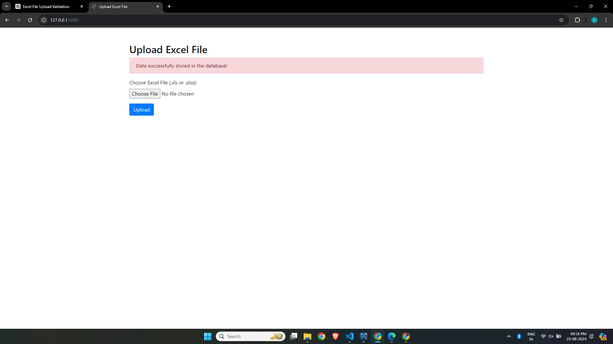
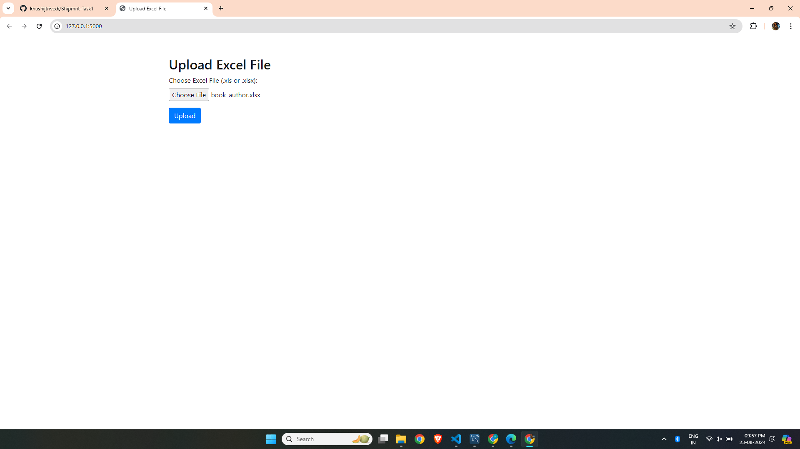
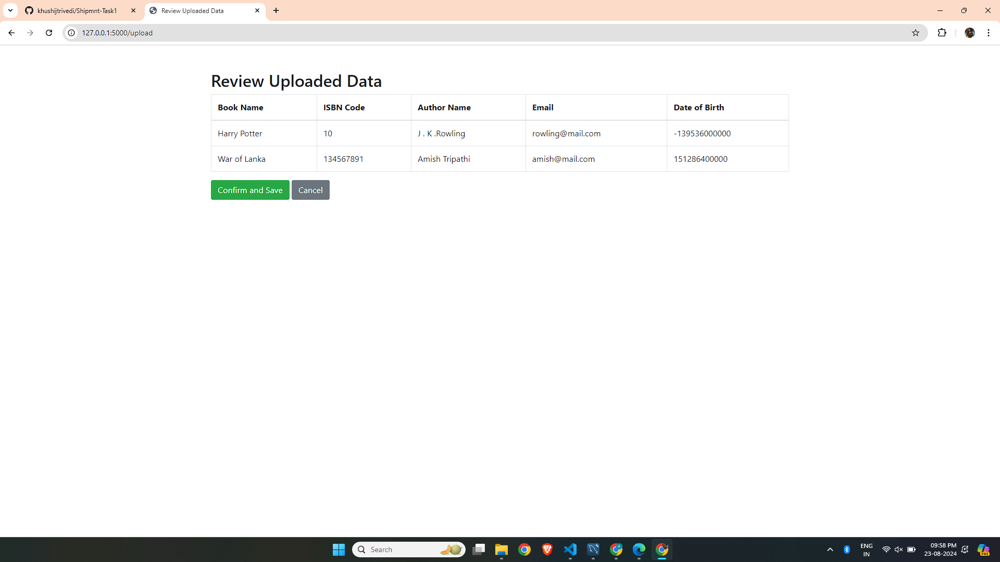
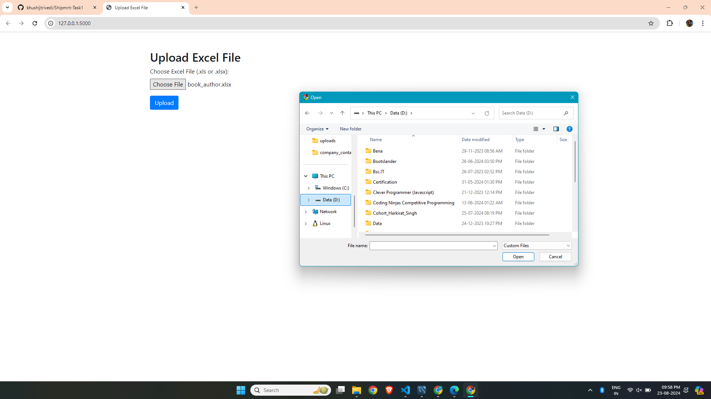

## Local Database Setup

When deploying the application, you might encounter issues with local database connections. Below are screenshots demonstrating the local setup and how it looks when it's functioning properly.

### Local Database Connection



### How It Works Locally

The following screenshot shows how the database setup appears when running the application locally:


The following screenshot shows how upload web page looks like:



The following screenshot shows how upload web page looks like when selecting any file to upload:



The following screenshot shows how data viewing web page looks like:



# Data Upload and Review Application

This is a Flask-based web application that allows users to upload Excel files, review the uploaded data in a table format, and confirm or cancel the data upload. It uses MySQL as the database to store the data.

## Features

- **Upload Excel File**: Allows users to upload Excel files (.xls or .xlsx).
- **Review Data**: Displays the contents of the uploaded file in a table for review.
- **Confirm and Save**: Saves the reviewed data to a MySQL database upon confirmation.
- **Error Handling**: Provides feedback on errors during file processing and data insertion.

## Technologies Used

- **Frontend**: HTML, Bootstrap 4
- **Backend**: Flask (Python)
- **Database**: MySQL
- **Libraries**: `pandas`, `mysql-connector-python`

## Setup

### Prerequisites

- Python 3.x
- MySQL server

### Installation

1. Clone the repository:
    ```bash
    git clone https://github.com/your-username/your-repository.git
    cd your-repository
    ```

2. Create and activate a virtual environment:
    ```bash
    python -m venv venv
    source venv/bin/activate  # On Windows use `venv\Scripts\activate`
    ```

3. Install dependencies:
    ```bash
    pip install -r requirements.txt
    ```

4. Configure MySQL:
   - Create a MySQL database named `shipmnt`.
   - Ensure the `Author` and `Book` tables exist with appropriate schemas.

5. Run the Flask application:
    ```bash
    python app.py
    ```

6. Navigate to `http://127.0.0.1:5000/` in your web browser to access the application.

## File Structure

- `app.py`: Main Flask application file.
- `templates/upload.html`: HTML file for uploading Excel files.
- `templates/view.html`: HTML file for reviewing uploaded data.
- `requirements.txt`: List of Python dependencies.

## Contributing

Feel free to submit issues or pull requests if you have any suggestions or improvements.

## License

This project is licensed under the MIT License - see the [LICENSE](LICENSE) file for details.
